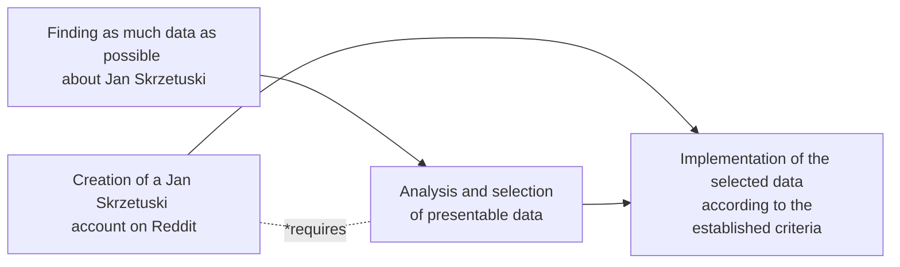

# Skrzetuski's Twitter

### Authors
Mateusz Mazurek (Mauzerov), Hubert Wasilewski (SNIAPA), Jakub Sobieraj (Qbi) i Nikodem Reszka (n-kodem)

## Overview
The project was created for the Polish lessons taught by Mr Dawid Ladach.

## Goal
Presenting informations about Jan Skrzetuski in an interesting way.

## Division of responsibilities
### Jakub Sobieraj
Finding potentially interesting photos of Jan Skrzetuski to fill the twitter account.

### Hubert Wasilewski
Finding informations about Jan Skrzetuski from the book "Potop" by Henryk Sienkiewicz that are 
suitable for an interesting presentation on "His" account on the Twitter platform.

### Mateusz Mazurek i Nikodem Reszka
Creating a Twitter account and implementing the informations found by the rest of the group 
into it in an interesting and simple way for the class.

## Stages of work

